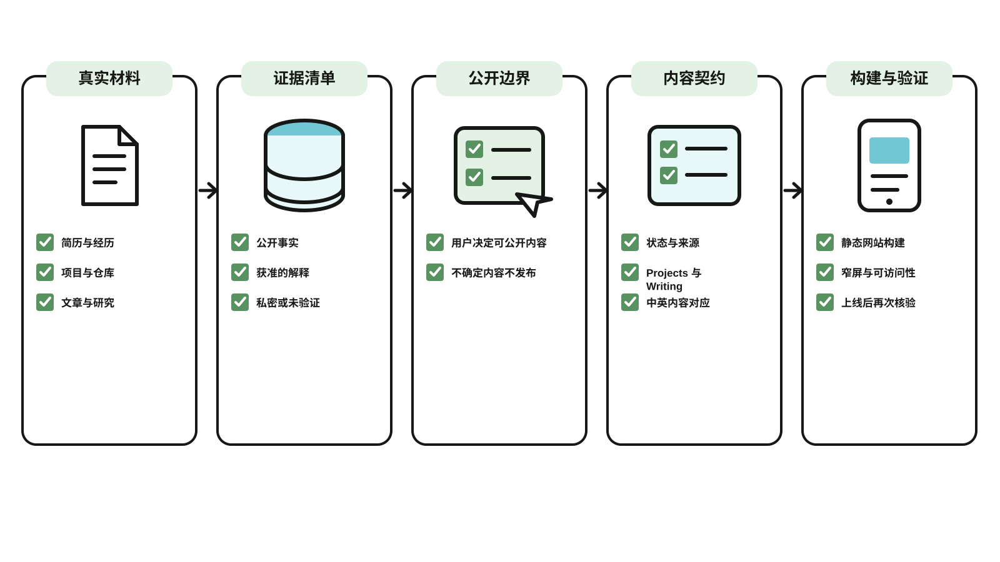

# Evidence-First Personal Site

**[English](README.md) | 中文**

一个用于构建或改版个人网站的 Skill，适用于 Claude Code、Codex 等 AI 编码 Agent。它把个人网站视为一份可长期维护的公开档案，而不是一张放大版简历，也不是一页用自我评价堆出来的个人宣传页。

它的目标是让访问者快速看懂三件事：你做过什么、你留下了哪些可验证的东西、这些经历处于什么状态。



*机制说明图，不是网站截图。用户先确认公开边界，Agent 才把证据整理成内容契约并构建、验证静态网站。双语生成源位于 [`docs/mechanism.json`](docs/mechanism.json)。*

## 它解决什么

很多个人网站的问题不是缺少设计，而是缺少边界：

- 项目看起来很多，但访问者不知道哪些仍可访问、哪些已经结束、哪些源码不能公开；
- 个人介绍写成大量“我很擅长什么”的自我描述，却没有足够事实支撑；
- 首页试图复述所有内容，结果既不像索引，也不像完整作品集；
- 为了做出“科技感”加入大标题、玻璃卡片和 AI 文案，反而遮住了真实材料；
- 网站做完后无法稳定发布、更新，或不小心暴露了不应公开的工作内容。

这个 Skill 提供一套默认方法：先盘点可公开证据，再组织内容和页面，最后在发布前检查真实状态、图片、移动端与 GitHub Pages 部署。

## 适合谁

- 有项目、文章、开源仓库、研究、产品实践或工作经历，想把它们整理成独立网站的人；
- 想用 GitHub Pages 长期维护个人档案的人；
- 想让 Agent 帮忙建站，但不希望它编造经历、滥用 AI 视觉套路的人。

它不适合公司官网、营销落地页，或需要登录、数据库、支付等动态服务的网站。

## 最终会得到什么

默认产物是一个静态 Astro 网站：

```text
Home        作为索引，帮助访客选择进入哪里
Projects    展示项目、状态、来源和公开证据
Writing     展示文章、日期、来源与阅读入口
About       作为可阅读的事实型简历
```

不需要四个页面都存在。没有公开文章时可以省去 `Writing`；研究者可以用 `Publications` 替代 `Projects`。原则是保留真实材料，不用空栏目制造完整感。

## 使用方式

把仓库克隆到你的 Agent 的 skills 目录。

Claude Code：

```bash
git clone https://github.com/alexliu072903-bit/evidence-first-personal-site ~/.claude/skills/evidence-first-personal-site
```

Codex：

```bash
git clone https://github.com/alexliu072903-bit/evidence-first-personal-site ~/.codex/skills/evidence-first-personal-site
```

然后在任务中直接说明：

```text
帮我基于现有简历、项目仓库和两篇文章，做一个个人网站。
要求：中文为主，公开项目与内部工作严格分开，部署到 GitHub Pages。
```

Skill 会先建立一份不公开的材料清单，确认哪些经历、截图、链接和判断可以发布；再确定信息架构与内容模型；最后实现、检查并在获得明确许可后发布。

## 你需要提供的最少材料

一个可用的第一版只需要：

- 一份可公开的基本信息或简历；
- 至少两个项目、工作样本或研究产出；
- 每个公开项目的一条可查看证据，例如产品链接、GitHub 仓库、文章、截图或 demo；
- 一个公开联系方式。

文章、个人照片、PDF 简历、奖项和完整 case study 都是可选项。没有材料时，Skill 会建议删掉对应栏目，而不是编造内容或放置占位卡片。

## 它如何保证内容真实

每项内容都会按三类处理：

| 类型 | 例子 | 处理方式 |
| --- | --- | --- |
| 公开事实 | 职位、日期、公开仓库、已发布文章 | 可以直接组织进页面 |
| 获准的解释 | 你对某个项目做过的具体贡献 | 以你确认过的范围表述 |
| 私密或未验证内容 | 内部路线图、未发布功能、无法确认的产品状态 | 不发布，或明确写为未知/历史状态 |

这意味着它不会把“参与过某件事”自动改写成“主导过某个系统”，也不会把 private source 包装成 open source。

## 默认的视觉判断

Skill 提供的是阅读效率和可信度的底线，不是强制的视觉品牌：

- 页面标题应当让首屏留给实际信息，而不是占据整个屏幕；
- 项目截图、公开仓库和文章是主要视觉证据；
- 个人照片可以提供真实生活感，但不能抢走项目本身的角色；
- 使用克制的层级、稳定比例和明确的状态标签；
- 避免渐变文字、半透明玻璃卡片、模板化卡片网格和泛 AI 文案；
- 没有视觉偏好时，默认提供“柔和底纹 + 白色证据卡片”：证据放在不透明的白色卡片上，卡片后面是一层很淡的底纹。它不会适合所有人，只是给没有主意的人一个还不错的选择，可以整体替换（见 `references/default-style.md`）。

## 包含的内容

```text
SKILL.md
  主流程：证据盘点、信息架构、构建顺序、发布边界

references/evidence.md
  项目、文章、经历和公开边界的材料清单

references/astro-foundation.md
  Astro 内容集合、路由结构和 GitHub Pages 部署约束

references/visual-and-qa.md
  朴素版视觉系统、页面层级、响应式、可访问性和发布前检查

references/default-style.md + assets/haze/
  默认的柔和底纹风格：参数、素材和替换方法

references/proof.md
  三件事与证据的对应、数字的出处规则、公开反馈截图、雇主工作的边界

references/voice.md
  文字风格：写用户能做什么，短标题，不为自己背书，附改前/改后对照

references/existing-site.md
  修改已有网站：先和线上同步、先诊断、学结构不抄内容、尊重已有决定

references/bilingual.md
  双语站点：内容结构、叶子节点翻译、切换后的残留检查

references/site-foundation.md + assets/site-foundation/
  从已确认 Site Contract 初始化的、无品牌视觉的 Astro Foundation

scripts/init-site.mjs + scripts/verify-site.mjs
  确定性的初始化与核心产物验证
```

## 发布前的最低检查

在对外发布前，Skill 要求至少确认：

1. 生产构建通过，且草稿不会出现在公开路由中；
2. 每个项目的当前状态和源码可见性准确；
3. 本地图片、外部链接、真实 Tab 键下的键盘焦点、文字对比度、多种宽度下的溢出没有明显问题；双语站点切换后没有残留文字；
4. 用户明确确认了公开的仓库、域名和内容边界；
5. 部署完成后，公开页面实际出现预期的新内容。

## 原则

> 让材料说明你是谁，而不是让形容词代替材料。

详细规则见 [SKILL.md](./SKILL.md)。

## License

[MIT](./LICENSE)
